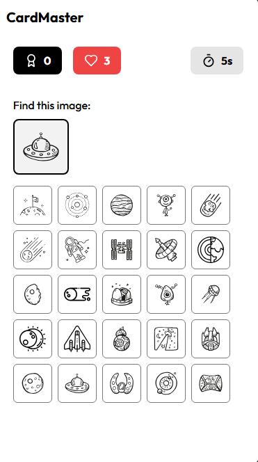

## 🌐 **Live Demo**  

🔗 [**Play Now**](https://cardo-git-main-shaheer831s-projects.vercel.app)  
# **Image Match Games**  


A high-speed, interactive web-based game platform featuring memory-matching challenges, developed with **React, TypeScript, and Tailwind CSS**.  

  
  
  

## 🎮 **Overview**  

**Image Match Games** is an engaging platform where players must quickly identify a target image within a grid of similar images. The game challenges reaction time, memory, and focus. Currently, the platform features two immersive game modes:  

- **🚀 Space Fun** – A cosmic-themed memory game with galactic visuals.  
- **🍔 Food Wars** – A fast-paced food-themed challenge with culinary imagery.  

## ✨ **Key Features**  

- **Fully Responsive** – Optimized for seamless gameplay across desktop and mobile.  
- **Dynamic Difficulty Scaling** – Game speed increases as your score rises.  
- **Lives & Scoring System** – Earn extra lives at milestones; faster matches yield higher scores.  
- **Smooth Animations** – Powered by Framer Motion for immersive visual feedback.  
- **Adaptive Grid System** – Grid size adjusts based on screen size:  
  - **Mobile:** 5×5 (25 images)  
  - **Desktop:** 8×14 (112 images)  

## 🛠️ **Tech Stack**  

- **React** – Modern UI development.  
- **TypeScript** – Ensuring type safety and better maintainability.  
- **Tailwind CSS** – Utility-first styling for a sleek design.  
- **React Router** – Navigation between game modes.  
- **Framer Motion** – Smooth transitions and animations.  
- **Locomotive Scroll** – Enhanced scrolling experience.  

## 🎯 **How to Play**  

1. Select a game mode from the home screen.  
2. Click **Start Game** to begin.  
3. Identify and click on the target image displayed at the top.  
4. Score points for correct matches (faster selections = higher points).  
5. Lose a life for incorrect selections or if time runs out.  
6. Gain an extra life for every **1,000 points** scored.  
7. Difficulty increases as your score rises:  
   - **> 300 points:** 8 seconds per round.  
   - **> 500 points:** 7 seconds per round.  
   - **> 1,000 points:** 5 seconds per round.  

## 🚀 **Getting Started**  

Clone the repository and set up the development environment:  

```bash
# Clone the repository
https://github.com/shaheer831/Cardo.git

# Navigate to the project directory
cd Cardo

# Install dependencies
npm install

# Start the development server
npm run dev
<<<<<<< HEAD
```

=======
>>>>>>> f9c1dd264f3079e04fd1057ba3e6d1622aaa6ff3
